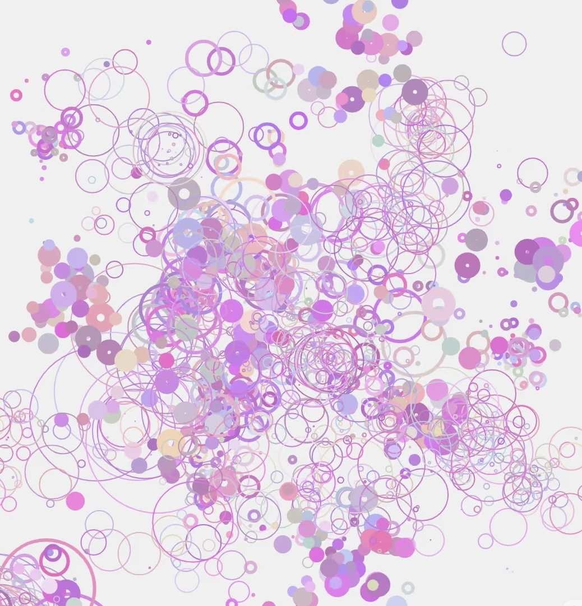
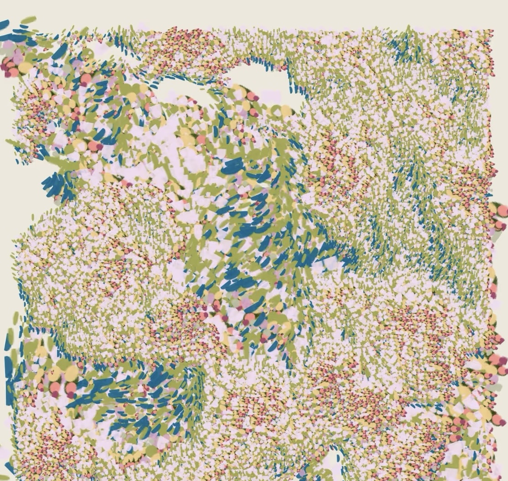
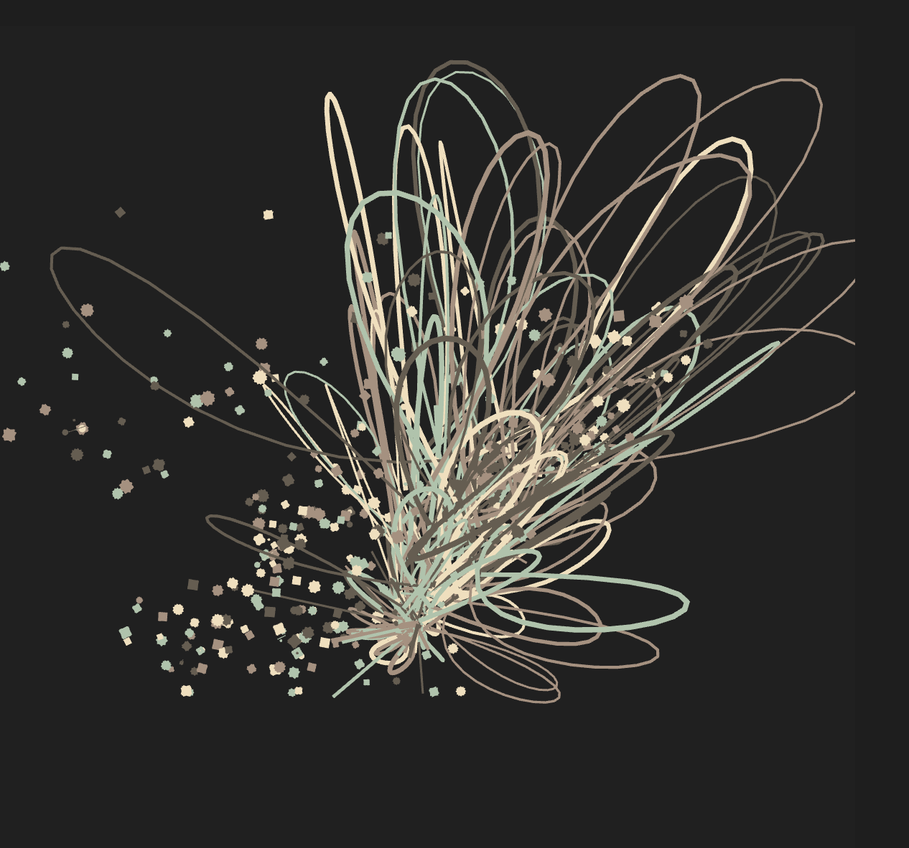

# Week9 quiz

## Part 1: Imaging Technique Inspiration

The artwork our group chose is ‘Ntange II (Grass)’ by Emily Kame Kngwarreye. The direction of our group is to combine point, line and surface elements with natural elements. Based on this direction, I will collect inspiration as follows.

  
  

# Artistic Inspiration: [SELINA]

I am greatly inspired by the artworks of SELINA, His works are composed through the rich layering of colors, points, lines, and planes, creating a vibrant and dynamic impression. By varying colors and the sizes of color blocks, he generates a strong visual impact.

## Inspirations Drawn from Her Work

- **Organic Forms**: He employs the composition of points, lines, and planes to create abstract representations of natural life forms from everyday reality.

- **Intuitive Layouts**: He employs large areas of color blocks, decorated with random or regular points, lines, and surfaces, making the picture more vivid and dynamic. This approach allows for a spontaneous and fluid composition that reflects the unpredictability of nature. 

## Part 2: Coding Technique Exploration

Based on the OpenProcessing sketch rhythm 11 by Samuel YAN, the effect of ink smudging can be achieved through the following steps:

Color Gradient Transition: Utilize the lerpColor() function to interpolate between colors, creating a smooth gradient transition from the center to the edges of the smudge. This simulates the natural diffusion of ink. Organic Flow with Noise and Curves: Apply the noise() function in conjunction with curveVertex() to draw curves that represent the flow of ink. The noise function introduces randomness, mimicking the unpredictable spread of ink on paper.

### The Coding Technique in Action

  
[Source](https://openprocessing.org/sketch/2529409)

### Related Functions

- [`lerpColor()`](https://p5js.org/reference/p5/lerpColor/)  
- [`noise()`](https://p5js.org/reference/p5/noise/)  
- [curveVertex()](https://p5js.org/reference/p5/curveVertex/)  

I can write a sentence referencing `helloWorld()`
> This is a blockquote.
